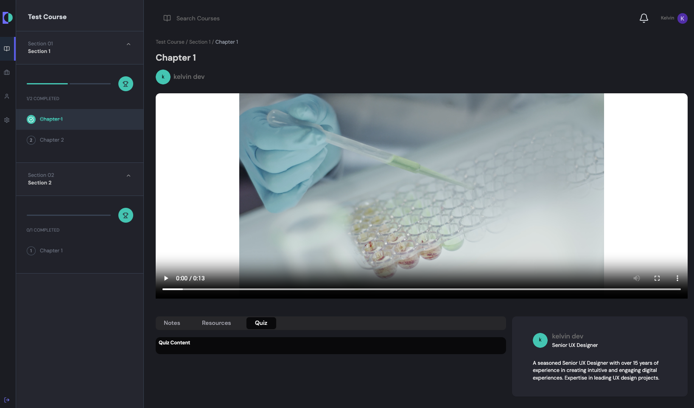
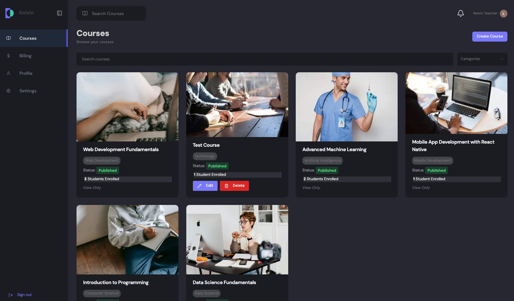

<br />
<div align="center">
  <a href="https://github.com/KelvinCYDev/fullstack-learning-management-app">
    
  </a>

<h3 align="center">Full stack Learning Management App</h3>

  <p align="center">
    A self-managed online video course platform for teachers and students
    <br />
    <a href="https://fullstack-learning-management-app.vercel.app">View Demo</a>
    &middot;
    <a href="https://github.com/KelvinCYDev/fullstack-learning-management-app/issues/new?labels=bug&template=bug-report---.md">Report Bug</a>
    &middot;
    <a href="https://github.com/KelvinCYDev/fullstack-learning-management-app/issues/new?labels=enhancement&template=feature-request---.md">Request Feature</a>
  </p>
</div>

[![Product Screenshot][product-screenshot]](https://fullstack-learning-management-app.vercel.app)

## Tech Stack

### Frontend

- [](#)
- [](#)
- [](#)
- [](#)

### Backend & Database

- [](#)
- [](#)
- [](#)

### Integrations

- [](#)
  - S3 + CloudFront
- [](#)
- [](#)

### Hosting

- [](#)
- [](#)
  - Lambda + ECR + API Gateway

<p align="right">(<a href="#readme-top">back to top</a>)</p>

## Features and Pages

- OAuth with Google for sign in and login
- Landing: Display featured courses
- Search: To search all types courses, and display the course details

### Student

[](https://fullstack-learning-management-app.vercel.app)

- Checkout
  - Allow students to purchase the course with credit card, either via guest checkin or account login
- Course
  - Course purchased will be displayed in the account after payment
  - Each course will have sections and chapters, each chapter will have a video tutorial
  - Support progress update, the chapter will be marked as completed when the video is played
- Profile
  - User settings and profile management
  - Billing section to show payment history

### Teacher

[](https://fullstack-learning-management-app.vercel.app)

- Course management
  - To create, edit, and delete own courses, support:
    - Sections and chapters
    - Video upload
  - Courses that created by other teachers can only be viewed

<p align="right">(<a href="#readme-top">back to top</a>)</p>

## Getting Started

### Prerequisites

- npm
  ```sh
  npm install npm@latest -g
  ```

### Installation

1. Install dependencies on /client and /server folder respectively

   ```bash
   npm install
   ```

2. Start the server

   ```bash
    cd ./server && npx run dev
   ```

3. Start the app

   ```bash
    cd ./client && npx run dev
   ```

<p align="right">(<a href="#readme-top">back to top</a>)</p>

[product-screenshot]: sample/Screenshot.png

## Credit

[YouTube](https://www.youtube.com/watch?v=61vSIrg70xM)
